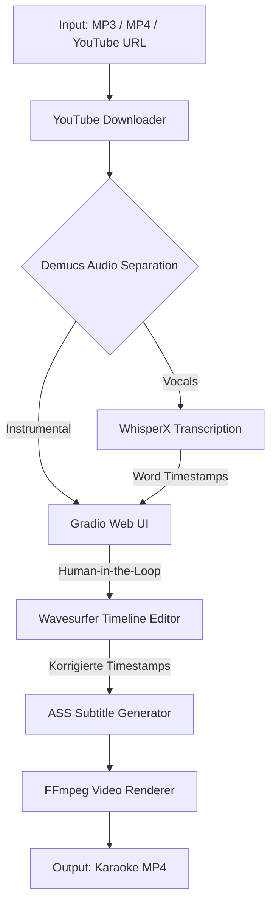

<div align="center">
  <h1>🎤 Auto-Videoke Studio</h1>
  <p>Die ultimative KI-gestützte Karaoke-Erstellungs-Pipeline (Human-in-the-Loop)</p>
  
  
  
  
  
  
</div>

---

## 🌟 Was ist das?

**Auto-Videoke Studio** ist ein professionelles Toolset, das aus jedem beliebigen Song vollautomatisch ein perfektes Karaoke-Video generiert. Durch die einzigartige Kombination modernster KI-Modelle und einer interaktiven Web-DAW behältst du die volle Kontrolle über das finale Ergebnis.

### ✨ Kern-Features
- **AI Stem Separation:** Isoliert glasklare Instrumentals und Vocals mit *Demucs*.
- **Word-Level Alignment:** Setzt präzise Timestamps für jedes einzelne Wort mithilfe von *WhisperX*.
- **Browser DAW Editor:** Verschiebe, verlängere oder lösche Timestamps visuell direkt im Browser (powered by *Wavesurfer.js*).
- **YT-DLP Integration:** Lade Songs und Videos vollautomatisch über einen einfachen YouTube-Link herunter.
- **Projekt-Management:** Speichere deine Sitzungen als `.zip`-Projektdatei ab und lade sie später zur Weiterbearbeitung.
- **ASS Subtitles & Dual-Coloring:** Generiert dynamische Karaoke-Untertitel (`.ass`) mit konfigurierbaren Highlight-Farben und Duett-Unterstützung.

---

## 📐 Architektur



---

## 🚀 Installation & Start (Docker)

Wir setzen voll und ganz auf ein **hardware-agnostisches Docker-Deployment**. Wähle das Profil, das zu deiner verbauten Hardware passt.

### Voraussetzungen
- [Docker](https://docs.docker.com/get-docker/) und [Docker Compose (v2)](https://docs.docker.com/compose/install/)

### Start-Befehle

**1. Für NVIDIA GPUs (Empfohlen)**  
*(Erfordert das [NVIDIA Container Toolkit](https://docs.nvidia.com/datacenter/cloud-native/container-toolkit/latest/install-guide.html) auf dem Host)*
```bash
docker compose --profile nvidia up --build
```

**2. Für AMD GPUs (ROCm)**  
*(Native Hardware-Beschleunigung unter Linux / WSL2 per Kernel-Passthrough)*
```bash
docker compose --profile amd up --build
```

**3. Für CPU / Mac / Intel**  
*(Lädt eine reine CPU-Version von PyTorch und nutzt Intel QuickSync Fallbacks falls verfügbar)*
```bash
docker compose --profile cpu up --build
```

Sobald der Container erfolgreich hochgefahren ist, erreichst du das Studio unter:  
👉 **http://localhost:7860**

---

## 🎮 UI Walkthrough

Das Arbeiten mit dem Auto-Videoke Studio ist in einen logischen Workflow unterteilt:

1. **Schritt 1: Input hochladen**  
   Füge einen YouTube-Link ein oder lade eine lokale Datei hoch. Klicke auf "Analyse starten". Ein schickes Lade-Modal blockiert die UI, während die KIs (Demucs & Whisper) im Hintergrund die Spuren trennen und die Timestamps berechnen.
2. **Schritt 2: Im Timeline-Editor korrigieren**  
   Sobald die Analyse abgeschlossen ist, landest du automatisch im Editor. Hier siehst du die extrahierten Spuren in einer interaktiven Wavesurfer-Ansicht. Die gelben Blöcke sind die Timestamps. Du kannst sie mit der Maus verschieben, trimmen oder neue anlegen, um die Synchronisation zu perfektionieren.
3. **Schritt 3: Farben wählen & Rendern**  
   Stelle rechts deine Wunschfarben für *Ungesungen* und *Gesungen (Highlight)* ein und klicke auf "Sync anwenden & Rendern". Das fertige Karaoke-Video wird über FFmpeg abgemischt und steht direkt zum Download bereit.

*Tipp: Du kannst deine Arbeit zwischendurch jederzeit als ZIP-Container über "Projekt speichern" exportieren und am nächsten Tag laden!*

---

## ⚙️ Konfiguration

Das Projekt ist extrem modular aufgebaut. Globale Einstellungen findest du in der Datei `configs/default.yaml`. 
Diese Datei wird über ein Volume (`./configs:/app/configs`) direkt in den laufenden Container gemountet.

Folgende Parameter kannst du dort dauerhaft anpassen:
- **Modell-Größen**: Welche Demucs/WhisperX-Modelle sollen geladen werden (z.B. `large-v2` vs `base`)?
- **Styles**: Standardfarben für das UI und die Untertitel.
- **Hardware-Encoding**: Fallback-Optionen wie der bevorzugte Video-Encoder (`h264_nvenc` vs `libx264`).
